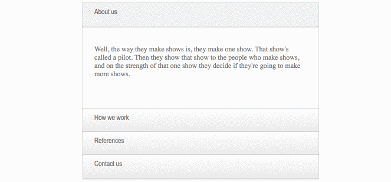

> :star: *Jeśli będziesz mieć problem z rozwiązaniem tego zadania, poproś o pomoc na odpowiednim kanale na Slacku, tj. `s1e02-html-and-css-basics` (dotyczy [mentee](https://devmentor.pl/mentoring-javascript/) oraz posiadaczy [kursu JavaScript](https://devmentor.pl/p/javascript-for-beginners/)) lub na [dedykowanej grupie fb](https://www.facebook.com/groups/155234921740033). Pamiętaj, aby treść Twojego wpisu spełniała [odpowiednie kryteria](https://devmentor.pl/jak-prosic-o-pomoc/).*

&nbsp;

# `#02` HTML i CSS: Podstawy

Znalazłeś w sieci bardzo fajne rozsuwane menu (ang. accordion menu) autorstwa `@anzjoy (Anz Joy)`, które działa bez wykorzystania JavaScriptu. Niestety okazało się, że w kodzie brakuje części selektorów.

Na szczęście ktoś zostawił komentarze, które pozwolą Ci uzupełnić brakujące elementy w pliku `./styles/index.css`.
Dodatkowo w nawiasach masz też informacje na temat specyficzności danego selektora.

Efekt ma być zbliżony do tego poniżej:

&nbsp;
> :arrow_left: [*poprzednie zadanie*](./../01) | [*następne zadanie*](./../03) :arrow_right:

> :no_entry: *Jeśli nie posiadasz materiałów do tego zadania, znajdziesz je na stronie [devmentor.pl](https://devmentor.pl/p/html-and-css-basics/)*
