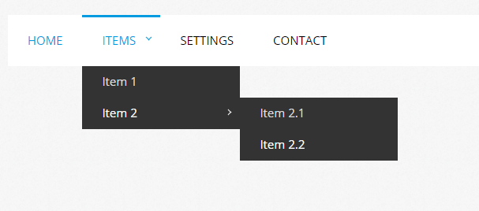

# Ćwiczenie #04

> :loudspeaker: Jeśli chciałbyś więcej tego typu zadań to zapraszam do :moneybag: [wsparcia mojego konta](https://github.com/sponsors/devmentor-pl)!

&nbsp;

Na każdej stronie znajdziesz mniej lub bardziej rozbudowane menu. 

Dlatego tym razem Twoim zadaniem bedzie wykonanie menu, które możę zawierać 3 poziomy:

Podpowiedzi:
- kolorystykę możesz pobrać za pomocą dodatku do Chrome tj. [ColorZilla](https://chrome.google.com/webstore/detail/colorzilla/bhlhnicpbhignbdhedgjhgdocnmhomnp)
- strzałki można uzyskać przy pomocy znaku większości i/lub mniejszości - odpowiednio odwrócony przy pomocy [transform: rotate()](https://www.w3schools.com/cssref/playit.asp?filename=playcss_transform_rotate)

&nbsp;

> :warning: Jeśli nie posiadasz materiałów do tego zadania to znajdziesz je na stronie [devmentor.pl](https://devmentor.pl/p/html-and-css-basics/)

