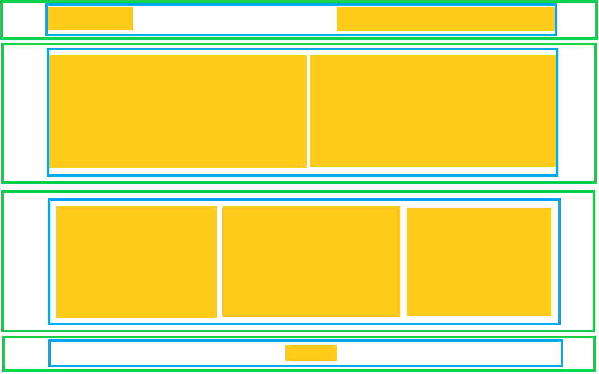

> :star: *Jeśli będziesz mieć problem z rozwiązaniem tego zadania, poproś o pomoc na odpowiednim kanale na Slacku, tj. `s1e02-html-and-css-basics` (dotyczy [mentee](https://devmentor.pl/mentoring-javascript/) oraz posiadaczy [kursu JavaScript](https://devmentor.pl/p/javascript-for-beginners/)) lub na [dedykowanej grupie fb](https://www.facebook.com/groups/155234921740033). Pamiętaj, aby treść Twojego wpisu spełniała [odpowiednie kryteria](https://devmentor.pl/jak-prosic-o-pomoc/).*

&nbsp;

# `#05` HTML i CSS: Podstawy

Nadszedł czas, aby stworzyć podstawowy układ strony. Poniżej przedstawiam jej schemat: 

&nbsp;

* **zielone krawędzie** to kontenery, które wypełniają całą szerokość okna przeglądarki (mają 100% szerokości),
* **niebieskie krawędzie** to maksymalna szerokość zawartości naszej strony. Przyjmijmy, że wynosi 1000px,
* **pomarańczowe prostokąty** to dowolna zawartość sekcji.

## Sekcja nr 1

Uznajmy, że to nasz nagłówek, który z lewej strony posiada logo, a z prawej – menu. Wykonaj to zadanie w taki sposób, aby elementy wyglądały jak doczepione do lewego i prawego boku.

## Sekcja nr 2

W tym przypadku mamy treść, która jest podzielona na dwie kolumny o tej samej szerokości. Kolumny dzieli niewielki odstęp. Podobnie jak w poprzedniej sekcji elementy mają przylegać do prawego i lewego boku wyznaczonego przez maksymalną szerokości strony (niebieskie krawędzie).

## Sekcja nr 3

W tej sekcji mamy 3 kolumny. Tym razem odstępy mają być jednakowe nawet między zawartością a niebieską krawędzią.

## Sekcja nr 4

Ostatni element to stopka, której wysokość ma być nie mniejsza niż 100px. Jej zawartość ma być wyśrodkowana w pionie oraz w poziomie.

&nbsp;
> :arrow_left: [*poprzednie zadanie*](./../04) | ~~*następne zadanie*~~ :arrow_right:

> :no_entry: *Jeśli nie posiadasz materiałów do tego zadania, znajdziesz je na stronie [devmentor.pl](https://devmentor.pl/p/html-and-css-basics/)*
